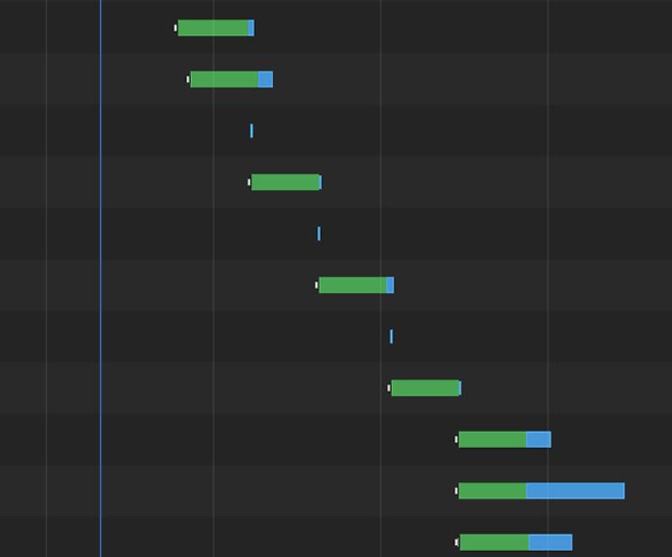
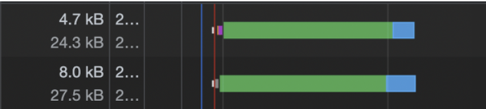

# React Query - Error Handling과 Suspense

### React Query란

it makes fetching, caching, synchronizing and updating server state in your web applications a breeze.
It works amazingly well out-of-the-box, with zero-config, and can be customized to your liking as your application grows.

Context API 기반으로 만들어져, getQueryDate, setQueryData 등 데이터 저장 관련 로직도 있다. 데이터 저장소로도 쓸 수 있다는 말이다.

### Error Handling

1. isError 반환값
   아래는 isError flag로 에러 핸들링을 하는 예시이다.

   but..
   아래와 같은 상황에선, background에서 refresh를 한다고 했을 때, 전체 할일 목록을 마운트 해제가 될 수 있다.
   (return문을 보면. 또 API가 일시적 오류 혹은 클라이언트의 일시적 오류가 발생할 수 있기에.)
   그리고 if~문의 보일러 플레이트 코드가 발생한다.

```tsx
function TodoList() {
  const todos = useQuery({
    queryKey: ["todos"],
    queryFn: fetchTodos,
  });

  if (todos.isPending) {
    return "Loading...";
  }

  // ✅ standard error handling
  // could also check for: todos.status === 'error'
  if (todos.isError) {
    return "An error occurred";
  }

  return (
    <div>
      {todos.data.map((todo) => (
        <Todo key={todo.id} {...todo} />
      ))}
    </div>
  );
}
```

2. Error Boundary와 함께
   react에서의 Error Boundary와 함께 사용할 수 있다.
   useQuery에 옵션값 `throwOnError: true`로 준다.
   (v5에서 기존 useErrorBoundary 옵션이 throwOnError로 이름이 변경)

```tsx
function TodoList() {
  // ✅ will propagate all fetching errors
  // to the nearest Error Boundary
  const todos = useQuery({
    queryKey: ["todos"],
    queryFn: fetchTodos,
    throwOnError: true,
  });

  if (todos.data) {
    return (
      <div>
        {todos.data.map((todo) => (
          <Todo key={todo.id} {...todo} />
        ))}
      </div>
    );
  }

  return "Loading...";
}
```

v3.23.0 부터는 다음과 같이 언제 error를 던질지 커스텀도 가능해졌다.

```tsx
useQuery({
  queryKey: ["todos"],
  queryFn: fetchTodos,
  // 🚀 only server errors will go to the Error Boundary
  throwOnError: (error) => error.response?.status >= 500,
});
```

하지만 ErrorBoundary 자체의 문제로 이벤트 헨들링과 비동기 처리를 할 때, 에러를 제대로 못 잡는 경우가 있었으니 주의하자. [(이번 미션에서도 예를 들면, 버튼 클릭 후 보내는 요청에서의 에러)](https://happysisyphe.tistory.com/66)

3. onError 콜백
   onError 일때 어떤 동작을 할지 콜백을 줄 수 있다.
   다만 v5부터 해당 콜백을 권장하지 않는다고 한다. (react-query v5 관련 얘기에서 후술)

```tsx
const useTodos = () =>
  useQuery({
    queryKey: ["todos"],
    queryFn: fetchTodos,
    // ⚠️ looks good, but is maybe _not_ what you want
    onError: (error) => toast.error(`Something went wrong: ${error.message}`),
  });
```

### 그럼 어떻게 쓰는게 좋을까

- useQuery의 반환값인 error 인자를 사용
- onError 콜백을 global QueryCache / MutationCache에서 사용
- Error Boundary를 사용

```tsx
const queryClient = new QueryClient({
  queryCache: new QueryCache({
    onError: (error, query) => {
      // 🎉 only show error toasts if we already have data in the cache
      // which indicates a failed background update
      if (query.state.data !== undefined) {
        toast.error(`Something went wrong: ${error.message}`);
      }
    },
  }),
});
```

### Suspense

useQuery에서 suspense 옵션을 true로 켜준다

```tsx
function App() {
  return (
    <Suspense fallback={<div>...loading</div>}>
      <TodoList />
    </Suspense>
  );
}

function TodoList() {
  const { data: todoList } = useQuery("todos", () => client.get("/todos"), {
    suspense: true,
  });

  return (
    <div>
      <section>
        <h2>Todo List</h2>
        {todoList?.data.map(({ id, title }) => (
          <div key={id}>{title}</div>
        ))}
      </section>
    </div>
  );
}
```

- Suspense에서 주의할 점
  query를 두개를 사용할 때, 다음과 같이 사용한다면 주의해야한다.
  Suspense는 Promise를 catch하여 Promise 상태에 따라서 children 또는 LoadingFallback 컴포넌트를 반환한다.
  pending 상태일 때에는 Loading을 반환하고 있고, children을 실행시키지 않는다는 것이다. 그럼 하나의 API 요청이 발생하면, children 컴포넌트의 실행은 멈추고 Loading을 반환하게 되기에 waterfall이 발생한다.
  

```tsx
function App() {
  return (
    <Suspense fallback={<div>...loading</div>}>
      <Before />
    </Suspense>
  );
}

// Before.jsx
const BASE_URL = "https://jsonplaceholder.typicode.com";
const client = axios.create({ baseURL: BASE_URL });

function Before() {
  const { data: todoList } = useQuery("todos", () => client.get("/todos"), {
    suspense: true,
  });

  const { data: postList } = useQuery("posts", () => client.get("/posts"), {
    suspense: true,
  });

  return (
    <div style={{ display: "flex" }}>
      <section>
        <h2>Todo List</h2>
        {todoList?.data.map(({ id, title }) => (
          <div key={id}>{title}</div>
        ))}
      </section>
      <section>
        <h2>Post List</h2>
        {postList?.data.map(({ id, title }) => (
          <div key={id}>{title}</div>
        ))}
      </section>
    </div>
  );
}
```

- 해결법 1
  useQueries를 쓴다. 쿼리가 병렬 처리 되며 suspense waterfall을 줄일 수 있다.
  

```tsx
function After_useQueries() {
  const [{ data: todoList }, { data: postList }] = useQueries([
    {
      queryKey: ["todo"],
      queryFn: () => client.get<Todo[]>("/todos"),
      suspense: true,
    },
    {
      queryKey: ["post"],
      queryFn: () => client.get<Post[]>("/posts"),
      suspense: true,
    },
  ]);

```

- 해결법 2
  useSuspenseQueries hook을 쓴다.
  v5부터는 안정적으로 suspense를 사용해 데이터 패칭을 할 수 있다. useQuery에서 사용하던 suspense: boolean 옵션은 제거되고 useSuspenseQuery, useSuspenseInfiniteQuery와 useSuspenseQueries를 사용한다고 한다.

새로 추가된 suspense hook은 로딩과 에러 상태를 Suspense와 ErrorBoundary가 처리하기 때문에 status가 언제나 success인 data 값을 반환한다.

```tsx
const { data: post } = useSuspenseQuery({
  // const post: Post
  queryKey: ["post", postId],
  queryFn: () => fetchPost(postId),
});
```

### react-query v5 관련

v5에서 주요 변경점은 useQuery에서 *콜백*을 제거하는 것이라고 한다.
(useMutation와는 상관 없는 이야기)
ex) onSuccess, onError, onSettled

위에서 onError 용법을 확인했듯 직관적인 API 이다.
다음과 같은 onError 용법에서, 만약 해당 콜백이 없다면 아래와 같이 useEffect를 사용했을 것이다.

```tsx
export function useTodos() {
  const query = useQuery({
    queryKey: ["todos", "list"],
    queryFn: fetchTodos,
  });

  React.useEffect(() => {
    if (query.error) {
      toast.error(query.error.message);
    }
  }, [query.error]);

  return query;
}
```

useEffect로 바꿔서 작성한 부분을 보면, useQuery에 onError를 사용할 때 문제점이 더 잘 보일 것 같다.
onError 콜백이 각 컴포넌트에서 실행된다는 것이다. 즉, 에러 콜백이 쿼리당이 아닌 컴포넌트당 실행 된다는 것이다.

[tkdodo의 블로그](https://tkdodo.eu/blog/react-query-error-handling#the-global-callbacks)에서는 이를 QueryCache에서 적용하라고 한다. 그러면 global callback으로 작동하며 쿼리당 처리가 가능하다고.

```tsx
const queryClient = new QueryClient({
  queryCache: new QueryCache({
    onError: (error) => toast.error(`Something went wrong: ${error.message}`),
  }),
});
```

-> 그렇다면 위 코드의 onError에 콜백 인자인 error 자체의 메시지가 아닌 Query마다 다른 메시지를 커스텀 하고 싶다면 어떻게 해야할까.

Query의 meta 필드를 이용한다.
meta는 어떤 정보를 채우는 임의의 객체인데, 전역 콜백 등 Query에 접근할 수 있는 모든 곳에서 사용 가능하다.
아래와 같은 코드이며, useQuery 인스턴스에서 onError를 설정하는 것과 비슷할 수 있지만 하나의 안전장치가 추가되었다고 볼 수 있다.

```tsx
const queryClient = new QueryClient({
  queryCache: new QueryCache({
    onError: (error, query) => {
      if (query.meta.errorMessage) {
        toast.error(query.meta.errorMessage);
      }
    },
  }),
});

export function useTodos() {
  return useQuery({
    queryKey: ["todos", "list"],
    queryFn: fetchTodos,
    meta: {
      errorMessage: "Failed to fetch todos",
    },
  });
}
```

---

이상 error와 관련된 callback 제거 이야기는 여기까지이다.
아래 내용은 콜백이 여러번 호출될 가능성을 잠재하는 것의 단점을 더 보여주는 것이다.
error와 관련된 내용은 아니니 스킵해도 무방하다.
(더 많은 예시들이 있지만 한가지만 봐보자)

쿼리를 사용하며 callback 함수에서 다음과 같이 상태를 업데이트 하는 경우가 허다하다고 한다.

```tsx
export function useTodos() {
  const [todoCount, setTodoCount] = React.useState(0);
  const { data: todos } = useQuery({
    queryKey: ["todos", "list"],
    queryFn: fetchTodos,
    //😭 제발 이러지 마세요
    onSuccess: (data) => {
      setTodoCount(data.length);
    },
  });

  return { todos, todoCount };
}
```

다음과 같이 사용한다면 `setTodoCount`이라는 렌더링 사이클을 끼워 넣는 것이다. 이건 앱을 필요 이상으로 자주 렌더링되게 하며 중간에 낀 렌더링 사이클에 잘못된 값을 포함 시킬 수 있다고 한다.

예를 들어 위 코드 예시에서 `fetchTodos`는 길이가 5인 array를 반환한다고 하자.
그럼 렌더링 사이클은 3번이다.

1. `todos`는 undefined이고, 길이는 0이다. 쿼리가 fetch되는 동안의 초기상태이다.
2. `todos`는 길이가 5인 array가 되고, `todoCount`는 0이 된다. `useQuery`와 `onSuccess`가 완료된 상태이고, `setTodoCount`는 앞으로 실행될 렌더링 사이클이다.
3. `todos`는 길이가 5인 array에서 `todoCount`가 5가 된다. 최종 상태이다.

이는 렌더링 사이클도 늘어나지만, 동기화되지 않은 상태로 렌더링이 중간에 된다는 것도 좋지 않다.

그냥 아래와 같이 [상태를 파생](https://tkdodo.eu/blog/dont-over-use-state)시키라고 한다.

```tsx
export function useTodos() {
  const { data: todos } = useQuery({
    queryKey: ["todos", "list"],
    queryFn: fetchTodos,
  });

  const todoCount = todos?.length ?? 0;

  return { todos, todoCount };
}
```

### 관련 hooks

- useQueryErrorResetBoundary
  근접한 QueryErrorResetBoundary 컴포넌트 하위의 모든 쿼리 오류를 재설정한다.
  `react-error-boundary` 라이브러리의 ErrorBoundary에 적용 가능하니 주의.

```tsx
import { useQueryErrorResetBoundary } from "@tanstack/react-query";
import { ErrorBoundary } from "react-error-boundary";

const App = () => {
  const { reset } = useQueryErrorResetBoundary();
  return (
    <ErrorBoundary
      onReset={reset}
      fallbackRender={({ resetErrorBoundary }) => (
        <div>
          There was an error!
          <Button onClick={() => resetErrorBoundary()}>Try again</Button>
        </div>
      )}
    >
      <Page />
    </ErrorBoundary>
  );
};
```

- useSuspenseQuery
  해당 훅은 throwOnError가 기본값으로 설정되어있다고 한다.
  `throwOnError: (error, query) => typeof query.state.data === 'undefined'`
  따라서 `error`, `isFetching` 반환값을 잘 활용하자.

```tsx
import { useSuspenseQuery } from "@tanstack/react-query";

const { data, error, isFetching } = useSuspenseQuery({ queryKey, queryFn });

if (error && !isFetching) {
  throw error;
}
```

# 참고 자료

- 쉽게 에러 토스트 메시지를 줄 수 있는 라이브러리를 찾았다.

```tsx
import toast from "react-hot-toast";

toast.error("Something went wrong");
```

- 참고 아티클
  [공식 문서](https://tanstack.com/query/latest/docs/framework/react/reference/useQueryErrorResetBoundary)
  https://tkdodo.eu/blog/breaking-react-querys-api-on-purpose
  https://velog.io/@cnsrn1874/breaking-react-querys-api-on-purpose
  https://tkdodo.eu/blog/react-query-error-handling
