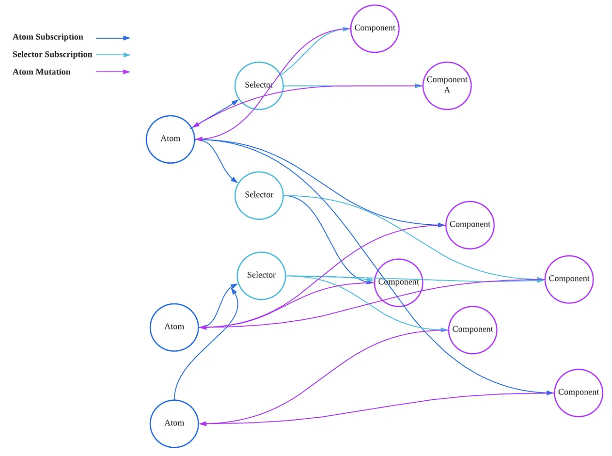
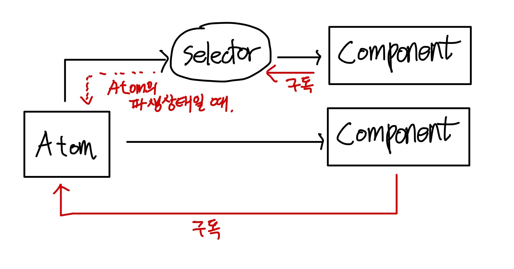
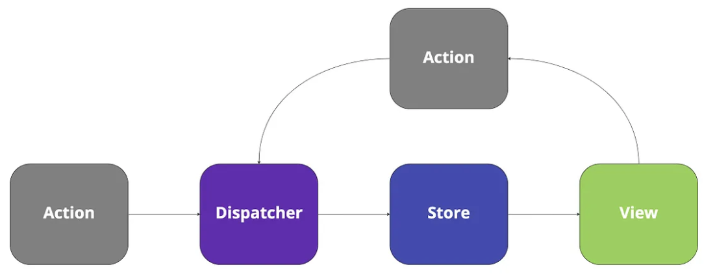

# Recoil과 상태흐름

## Recoil이란?

React의 Concurrent Renderer를 공식 지원하는 상태 관리 라이브러리.
상태 관리에서 말하는 "상태"는 일반적인 데이터가 아닌 UI를 업데이트하는 데이터이다.

> 상태관리 라이브러리는 컴포넌트 트리에서 거리가 먼 컴포넌트 간에 공유하는 상태를 쉽고 안정적으로 관리하게 해준다.

### - Recoil에서 전역 상태를 관리하는 상태 흐름

Atom : 하나의 전역 상태. 모든 컴포넌트에서 접근 가능하다.
Selector : 파생 전역 상태. 다른 Atom이나 Selector를 응용해 새로운 상태 값을 계산하고 반환한다.

Recoil의 컨셉은 `그래프`입니다. 즉, 각 Atom, Selector가 하나의 노드가 되어서 어느 컴포넌트에서든 상태 구독이 가능합니다.



하나의 노드(Atom)에서 이를 구독하여 업데이트 되는 노드(Selector)가 생기고 이들을 구독하는 컴포넌트로 구성되는 그래프입니다.
데이터의 흐름은 상태 -> 컴포넌트의 단방향 데이터 흐름입니다.



단순함과 안정성이 Recoil의 최대 장점이라 할 수 있다.
동시에 파생 상태는 상태 주체의 변화에 따라 자동으로 업데이트 된다.

> 여기서 단방향 데이터 흐름에 대해 저는 헷갈렸는데 여러분은 어떤가요?
> 예를 들어,`데이터 -> 컴포넌트 UI 변화` 로의 흐름인데, 컴포넌트 단에서 데이터를 update하면 양방향 바인딩 아닌가? 했습니다.
> 여기서 말하는 단방향 바인딩은 흐름은 오로지 data -> view로 흐릅니다. input 태그에서 입력을 함에 따라 데이터가 변경되는 것이 아닌, 입력 값으로 데이터를 변경시키고, 이 변경된 데이터가 뷰로 보여지게 됩니다.
> 양방향 바인딩은 Vue, angular 같은 프레임워크가 지원하고, 뷰에서 입력값이 변경되면 데이터가 변경되는 흐름을 가집니다.

### Recoil의 단점 (미션에서 느낀)

- **언제 어디서 전역 상태를 변경했는지 알기 어렵다.**

  전역 상태는 자체는 단방향으로 흐르기에 파악하기 쉽다.
  하지만 하나의 전역 상태(Atom..)를 여러 컴포넌트에서 사용한다면?
  
  어느 컴포넌트가 언제 전역 상태를 변경하는지 디버깅하기 어렵다.
  
  전역 상태 자체의 단점이기도 하다. 자식과 부모 컴포넌트 전체에서 전역 상태에 접근이 가능하니 사실 어디서든 전역 상태 업데이트가 가능하기 때문이다.
  (Redux는 공식 개발자 도구가 있다고 함)

- **React에서 사용할 때는 hook(useRecoilValue)를 사용한다.**

  즉, 컴포넌트 최상단에서 호출해야한다. 예를 들어, Id의 배열인 Atom이 있다고 하자. 그리고 Id 인자를 받아 Id에 따른 Quantity를 저장하는 SelectorFamily를 만들었다고 하자.
  
  다음과 같이 사용하는건 불가능하다. (내가 모르는 다른 기능이 있을 수도?)
  
  ```tsx
  const ids = useRecoilValue(productsIds);
  
  ids.forEach((id) => {
    // ❌
    const quantity = useRecoilValue(productQuantity(id));
    // ...
  });
  ```
  
  따라서 quantity 전역 변수를 만들기 위해 새로운 Selector를 만들어줘야했었다.
  
  ```tsx
  export const productQuantityState = selectorFamily<number, number>({
    key: "productQuantityState",
    get:
      (id: number) =>
      ({ get }) => {
        const products = get(productsState);
        const product = products.find((item) => item.id === id);
        return product ? product.quantity : 0;
      },
  });
  ```

# 보충 설명

### - react의 Concurrent Rendering

동시성 렌더링.
기존에는 만약 렌더링 할 것이 A, B 두가지 일때, A가 끝나고 B를 렌더링 했다.
하지만 동시성 렌더링에서는 A가 대기 상태일 때(ex.오래 걸릴 때) 이를 중단하거나 재개, 폐기할 수 있다.
즉, 리액트는 무거운 렌더링 작업을 하는 동안에도 사용자와의 상호작용에 더 빨리 반응할 수 있게 된다.

리액트 18 이전에는 렌더링이란 개입할 수 없는 단 하나의 동기적 처리였다. 따라서 한번 렌더링이 시작되면 중단할 수 없었다.

리액트 18에서 동시성 렌더링이 도입되고, suspense, 스트리밍 서버 렌더링, 변이 같은 새로운 기능이 소개되었다.

### - 상태 관리 라이브러리 - Flux 패턴의 Redux, Mobx 등

현재는 Redux Toolkit(RTK)가 있어 사용하기 쉬웠지만 여전히 보일러 플레이트 코드가 많다.
Flux 패턴은 `Action -> Dispatcher -> Store -> View` 같이 단방향 전역 상태 흐름. 예측 가능한 상태 관리를 도와준다.



예측 가능함이란, 전역 상태 수정을 위해 반드시 액션을 수행해야하기 때문에 데이터의 흐름 파악이 비교적 쉽다.

다만, Redux는 React의 concurrent rendering을 지원하지 않는다.

### - 상태를 관리하는 react의 기본 API

- useState
  부모에서 props drilling이 불편하며, 하나의 prop이 바뀔 때마다 리렌더링

- useContext
  하나의 상태마다 Context Provider로 감싸줘야하며, 캐싱 기능은 없다.

### - 꿀팁

- Selector를 redux의 middleware 역할을 하게 만들 수 있다.
- Selector Family로 selector에 파라미터(쿼리)를 전달해 만들 수 있다.
- Selector에서 여러 개의 비동기 쿼리를 요청 시, waitForAll API로 동시에 요청 가능하다.
- React의 Suspense와 Error Boundary와 잘 맞는다.
- useTransactionObserver를 이용해 어느 컴포넌트에서나 전역 상태 구독이 가능하다.
