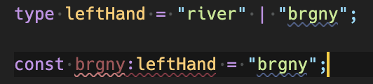
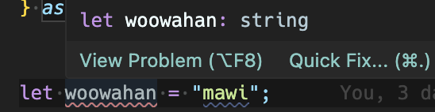
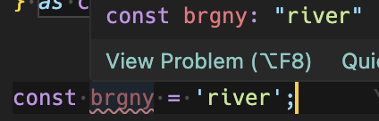
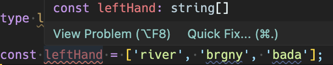
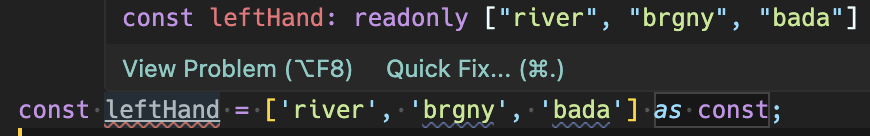
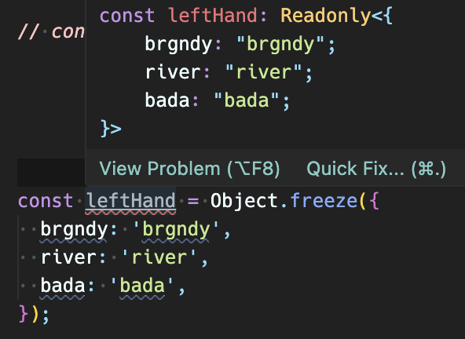
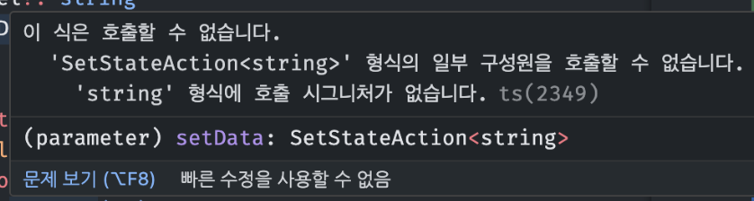
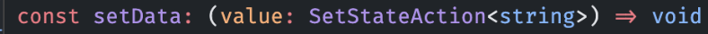
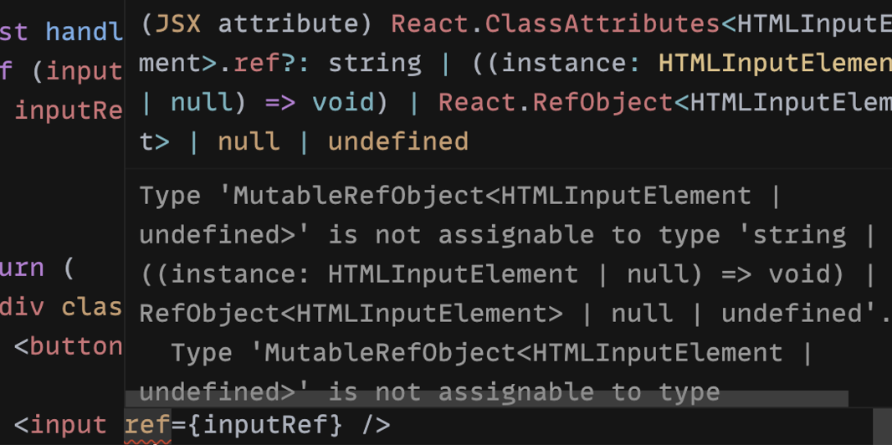

# React에서의 Types

ps) 1장과 2장의 내용은 리액트 관련이 아닌 타입스크립트 자체에 대한 개념입니다. 3장부터 React에서의 Type 관련 내용입니다.

# 1. 리터럴 타입이란

: 타입이 구체적인 어떤 값인 것

### 타입 지정 방식

- 타입을 선언하고, 변수의 타입으로 지정한다 → `명시적 타입 지정`

  

- let 변수로 선언하면 알아서 string으로 타입을 `추론`한다. → `암시적 타입 지정`

  

- const 변수로 선언하면, 바뀌지 않으니 선언된 값으로 리터럴 타입을 추론한다 → `리터럴 값을 타입으로 추론`
- 
  

> 그렇다면 객체도 const로 선언하면, 리터럴 타입으로 추론되는가

아니다. string의 배열로 추론된다. 리터럴 값의 배열로는 추론되지 않는다.



<br />

> 타입 스크립트는 언제 리터럴 타입으로 추론하는가?

값의 불변성이 보장된 경우 리터럴 타입으로 추론한다.
하지만 객체는 참조 타입이라, const로 선언해도 추론범위가 한정되지 않으며, 값을 변경 가능하기에..

<br />

> 객체를 리터럴 타입으로 추론해보자

1. as const로 리터럴 타입 추론 유도하기

   

이렇게 하면 string[ ]가 아닌 리터럴 타입의 배열로 추론한다.
leftHand[0] = ‘mawi’로 변경 시, ts Error가 난다.

1. Object.freeze 쓰기

   

이렇게 하면 리터럴 타입의 객체로 추론한다.
다만, 얕은 freeze이다. 중첩 객체의 값은 변경 가능하다.

# 2. as const

키워드 : as 타입 단언

### TL;DR

- 객체의 변경 + 중첩 객체의 변경을 막는다 → `as const`
- 리터럴 타입 추론을 하고 싶다 → `as const`
- 런타임에서의 객체의 변경을 막고 싶다(얕은 freeze) → `Object.freeze`

아래와 같이 상수로 쓸 객체들을 정의하는데, as const의 역할이 뭔지 궁금했다.

```jsx
export const MONTH_DETAILS = {
  january: 1,
  december: 12,
} as const;

export const EXPIRATION_ERROR_TYPE = {
  nonNumeric: 'NON_NUMERIC',
  invalidMonth: 'INVALID_MONTH',
  invalidExpirationDate: 'INVALID_EXPIRATION_DATE',
  notError: 'NOT_ERROR',
} as const;

export const Z_INDEX = {
  TOP_NAV: 100,
  BOTTOM_NAV: 100,

  POPUP: 90,
  TOAST: 80,

  BOTTOM_SHEET: 60,
  BACKDROP: 50,

  DROPDOWN: 10,

  HEADER: 1,

  CLICKABLE: 3,
  ANIMATED: 2,
  ELEVATED: 1,
} as const;
```

이는 as 타입 단언으로 해당 객체(혹은 배열도 가능)가 변경되지 않는 ‘리터럴 타입’임을 명시한다.
즉, Z_INDEX.TOP_NAV = 200 이런 식으로 변경을 허용하지 않는다고 한다.

> 그렇다면 Object.freeze와 어떤 차이인지 궁금했다.

### 1) 실행 타임 - 타입 제약 vs 객체 불변성 이다.

as const는 타입스크립트의 기능으로 컴파일 타임에 동작한다.
Object.freeze는 자바스크립트의 기능으로 런타임에 동작한다.
따라서 ts 에러를 무시하고 as const로 해도 런타임에 해당 객체가 변할 수는 있다.
완전한 불변성 객체로 만들고자 한다면 Object.freeze로 만들어야 한다.

### 2) 중첩 객체의 불변성을 보장 여부

Object.freeze는 중첩 객체의 변경을 막을 수 없다.

```jsx
const animalTypeMap = Object.freeze({
  lili: "cat",
  buge: "dog",
  tata: { age: 12 },
});

animalTypeMap.tata.age = 55; // 수정 가능
```

But, as const는 막아줌!

```jsx
const animalTypeMap = {
  lili: "cat",
  buge: "dog",
  tata: { age: 12 }
} as const;

animalTypeMap.tata.age = 55;  // ⚠ Error(TS2540) 읽기 전용 속성이므로 age 에 할당할 수 없습니다.
```

# 3. React.FC 타입

### 탄생 배경

Function Component 타입의 줄임말이다. 이는 함수 컴포넌트의 Props 타입을 간결하게 표현하기 위해 만들어졌다. Props에 기본적으로 children이 포함되어 있어 컴포넌트에서 자식 요소를 손쉽게 다루도록 의도했다고 한다.

### 예시

```tsx
const LeftHand: React.FC = () => {
    return (
        ...
    )
}
```

### 안티 패턴인가?

- React.FC는 children을 암시적으로 가지고 있다?
  FC를 이용하면 컴포넌트 props는 type이 ReactNode인 children을 암시적으로 가지게 된다.

  아래 코드를 보게 되면`<App />` 컴포넌트에서 children을 다루고 있지 않음에도 Example에서 children을 넘겨주고 있으며, 어떤 런타임 에러도 발생하지 않는다.

  즉, Props가 명확하지 않게 된다.

  ```tsx
  const App: React.FC = () => { // 📌 children을 안 받고 있어도...
    return <div>hi</div>;
  };

  const Example = () => {
    return (
      <App>
        {" "}
        <div>Unwanted children</div>   <!-- 📌 이 부분 !! -->
      </App>
    );
  };
  ```

<br />

- 😅 react 18버전에서는 사라졌다
  React 18 업데이트로, FC의 암시적인 children이 삭제되었다고 한다. 따라서 위와 같이 쓰면 컴파일 에러가 난다고 한다..?!

  <br />

- 그래서 어떻게 쓸까?
  개발자의 맴이라고 한다..

  그나마 이런 리액트에서 타입을 고민하게 된 계기이기도 했던 페어 지니🧞‍♂️의 코드에서 힌트를 찾았다.
  제네릭을 사용하며 조금씩 타입을 좁혀가는 생각을 해보게 되었다.

  ```tsx
  interface ModalProps {
  isOpen: boolean;
  onToggle: () => void;
  position: ModalPosition;
  }

  type ModalHeaderType = React.FC<React.PropsWithChildren<{ title: string }>>;
  type ModalContentType = React.FC<React.PropsWithChildren>;
  type ModalFooterType = React.FC<React.PropsWithChildren>;

  const Modal: React.FC<React.PropsWithChildren<ModalProps>> & {
    ModalHeader: ModalHeaderType;
    ModalContent: ModalContentType;
    ModalFooter: ModalFooterType;
  } = ({ children, isOpen, onToggle, position = 'center' }) => { ... }
  ```

# 4. ReactNode 타입

ReactNode 타입은 jsx 내에서 사용할 수 있는 모든 요소의 타입이다. ReactElement, string, number, null, undefined 등을 모두 포함하는 가장 넓은 타입을 허용한다는 의미로 쓴다.

보통은 children의 타입으로 많이 받는 것 같다. 즉, children에 뭐든 와도 된다는 말 아닐까?

다음은 [@types/react](https://github.com/DefinitelyTyped/DefinitelyTyped/blob/master/types/react/index.d.ts#L179)의 index.d.ts이다.

```tsx
type ReactNode =
  | ReactElement
  | string
  | number
  | Iterable<ReactNode>
  | ReactPortal
  | boolean
  | null
  | undefined
  | DO_NOT_USE_OR_YOU_WILL_BE_FIRED_EXPERIMENTAL_REACT_NODES[keyof DO_NOT_USE_OR_YOU_WILL_BE_FIRED_EXPERIMENTAL_REACT_NODES];
```

### 예시

```tsx
import { ReactNode } from "react";

interface Props {
  children: ReactNode; // 📌 이 부분 ~
}

const Component: React.FC<Props> = ({ children }) => {
  return <div>{children}</div>;
};
```

# 5. ReactElement 타입

위에서 본 ReactNode에 속한 타입이기도하다.
원시 타입을 허용하지 않고, jsx 요소만을 허용한다.

jsx 요소만을 children으로 허용하고 싶을 때, 명확한 타입지정이 가능할 것 같다.

````tsx
/**
 * Represents a JSX element.
 *
 * Where {@link ReactNode} represents everything that can be rendered, `ReactElement`
 * only represents JSX.
 *
 * @template P The type of the props object
 * @template T The type of the component or tag
 *
 * @example
 *
 * ```tsx
 * const element: ReactElement = <div />;
 * ```
 */
interface ReactElement<
  P = any,
  T extends string | JSXElementConstructor<any> =
    | string
    | JSXElementConstructor<any>
> {
  type: T;
  props: P;
  key: string | null;
}
````

### 예시

```tsx
import { ReactElement } from "react";

interface Props {
  children: ReactElement;
}

const LeftHand: React.FC<Props> = ({ children }) => {
  return <div>{children}</div>;
};
```

# 6. PropsWithChildren 타입

interface Props를 선언할 때, children을 반복적으로 설정해야하는 귀찮은 일을 줄일 수 있다.

다음과 같이 children이 옵셔널 값으로, children을 써도 되고 안 써도 된다.
제네릭 P를 통해 다른 Props를 함께 사용 가능하다. (예시를 보면 간단히 이해 가능)

```tsx
type PropsWithChildren<P = unknown> = P & { children?: ReactNode | undefined };
```

### 예시

```tsx
import { PropsWithChildren } from "react";

interface Props {
  name: string;
  // children을 사용하지만, 설정을 안해도 된다 !
}

export const Foo: FC<PropsWithChildren<Props>> = ({ name, children }) => {
  return (
    <>
      <div>{name}</div>
      <div>{children}</div>
    </>
  );
};
```

- 주의..
  React.FC에서 언급한 children이 암묵적으로 들어가서, children을 사용하지 않아도 에러가 나지 않는다.

  -> children을 반드시 사용하는 컴포넌트에서는 PropsWithChildren을 사용하지 않는게 좋지 않을까. children이 옵셔널 값이니까!

# 7. SetStateAction 타입

Props로 state를 set하는 함수로 넘기면서, 타입을 이렇게 설정해왔다.

```tsx
interface Props {
  setSomething: (someThing: string) => void;
}
```

이렇게 했을 때, 작동은 하지만 몇가지 불편한 점이 있다.

- 이게 setState 함수인지, 일반 함수인지 알 수 없다. 네이밍을 통해서만 유추 가능.
- 인자 이름 등을 다시 써줘야한다...

React에선 SetStateAction 타입을 제공한다.
useState, useReducer 훅에서 상태 값을 업데이트하기 위한 함수에 사용되는 타입이다.

### 예시

```tsx
interface Props {
  setData: Dispatch<SetStateAction<string>>;
}
```

해당 타입의 정의는 다음과 같다.

```tsx
type SetStateAction<S> = S | ((prevState: S) => S);
```

## Dispatch?

ps) 이 부분은 아직 어려워서 잘 아는 사람이 있다면 설명해줘도 좋을 것 같다.

Dispatch는 React에서 상태를 업데이트하는 함수의 호출 시그니처이다.
아래와 같이 정의되어 있다. void를 리턴하는 모습이다.

```tsx
type Dispatch<A> = (value: A) => void;
```

위의 SetStateAction에서 Dispatch로 감싸져서 사용되고 있다.
만약 Dispatch를 떼고 사용한다면?

```tsx
interface Props {
  setData: SetStateAction<string>;
}
```

다음과 같은 에러가 난다.



다만, setState 함수는 아무것도 반환하지 않는, void이다.


즉, SetStateAction은 본인을 인자로 해서 void를 리턴하는 호출 시그니처에, 자기 자신을 감싸줘야 했던 것이다

### 미션 사용 예시

```tsx
//useState에 타입 줄때
export interface ModalType {
  setIsOpen: React.Dispatch<React.SetStateAction<boolean>>;
  isOpen: boolean;
}
```

# 8. RefObject 타입

useRef 훅을 쓸 때, 반환 타입은 두 가지 이다. `MutableRefObject`, `RefObject`.
함수의 초깃값을 .current에 저장할 뿐이다.

```tsx
interface MutableRefObject<T> {
  current: T;
}

interface RefObject<T> {
  readonly current: T | null;
}
```

(! 어려움 주의)
@types/react의 d.ts 정의를 보면, useRef 훅의 타입 정의가 3개가 오버로딩 되어있다..
useRef가 쓰이는 3가지 경우가 있어서라고 하는데...

1. `useRef<T>(initialValue: T): MutableRefObject<T>;`
   : 인자의 타입과 제네릭의 타입이 T로 일치하는 경우.
   -> `MutableRefObject<T>`를 반환한다. current 속성 값을 변경 가능하다.

2. `useRef<T>(initialValue: T | null): RefObject<T>;`
   : 인자의 타입이 null을 허용하는 경우, `RefObject<T>`를 반환한다.
   -> current 속성을 직접 수정할 수 없다.

3. `useRef<T = undefined>():MutableRefObject<T | undefined>;`
   : 제네릭의 타입이 undefined인 경우. (타입을 제공하지 않은 경우), `MutableRefObject<T | undefined>`를 반환한다.

### 예시 좀 보자..

다음 예시는 1번 경우의 예시이다.
useRef를 로컬 변수로 사용하는 경우이며, 버튼 클릭 시 localVarRef.current 값이 1씩 증가한다.
1번 경우의 예시는 current를 직접 수정이 가능하다고 했다. 따라서 이 ref를 직접 수정하며 변경이 일어나도 리액트의 렌더링이 일어나지 않는 변수처럼 사용 가능하다.

```tsx
import React, { useRef } from "react";

const App = () => {
  const localVarRef = useRef<number>(0);

  const handleButtonClick = () => {
    if (localVarRef.current) {
      localVarRef.current += 1;
      console.log(localVarRef.current);
    }
  };

  return (
    <div className="App">
      <button onClick={handleButtonClick}>+1</button>
    </div>
  );
};

export default App;
```

다음 예시는 2번 경우의 예시이다.
아마 미션을 하며 focus를 옮기기 위해 다음과 같이 써봤을 것이라 생각한다.
input DOM 요소를 ref에 받아서 focus를 하거나 current의 값을 사용한다.

여기서 2번 예시의 경우 current 속성을 변경할 수 없다고 했는데, 어떻게 current.value 값을 수정하며 사용 가능한지 의문일 것이다.

이는 inputRef.current 속성 자체는 읽기 전용으로 변경이 불가능하지만, inputRef.current.value는 readonly가 shallow 하기 때문에 current의 하위 속성인 value 값은 수정이 가능하다.

`<input ref={inputRef} />` 처럼 쓴 경우에는 그럴 일이 잘 없겠지만, inputRef.current 자체를 수정하면 에러가 난다.

```tsx
import React, { useRef } from "react";

const App = () => {
  const inputRef = useRef<HTMLInputElement>(null);

  const handleButtonClick = () => {
    if (inputRef.current) {
      inputRef.current.focus();
      inputRef.current.value = "";
    }
  };

  return (
    <div className="App">
      <button onClick={handleButtonClick}>+1</button>

      <input ref={inputRef} />
      <button onClick={handleButtonClick}>Clear</button>
    </div>
  );
};

export default App;
```

3번 예시는 2번 예시에서 살짝만 수정해볼까...
2번 예시에서 초기값을 null이 아닌 undefined로 주었다.

```tsx
const inputRef = useRef<HTMLInputElement>();
```

그럼 `<input ref={inputRef} />` 태그 쪽에서 에러가 발생한다.
HTML 태그의 ref 속성은 `RefObject` 타입만 받는데,
inputRef가 현재는 `MutableRefObject`가 되어버렸다.
이를 ref 속성에 넣으려하니 발생한 에러이다.


### (정리) useRef 훅의 타입

- useRef를 로컬 변수 용도로 사용하는 경우 : `MutableRefObject<T>` 타입을 써야한다. 따라서 다음과 같이 초깃값을 넣어주자.

  ```tsx
  const localVarRef = useRef<number>(0);
  ```

- useRef를 DOM 조작 용도로 사용하는 경우 : `RefObject<T>` 타입을 써야한다. 따라서 다음과 같이 초깃값을 null로 넣어주자.

  ```tsx
  const inputRef = useRef<HTMLInputElement>(null);
  ```

# 9. React에서 Event 타입

타입스크립트 환경에서, event가 어디서 왔는지 타입 지정을 해줘야한다!

### FormEvent

- `FormEvent<HTMLInputElement>`
- `FormEvent<HTMLFormElement>`
- ...

### ChangeEvent

- `ChangeEvent<HTMLInputElement>`
- `ChangeEvent<HTMLSelectElement>`
- ...

### MouseEvent

- `MouseEvent<클릭할 요소 타입>`
- ...

### 예시

```tsx
//Submit 타입 만들기
export interface SubmitEvent {
  e: React.FormEvent<HTMLFormElement>;
}

// 혹은
const onChange = (event: React.ChangeEvent<HTMLInputElement>) => {
  const {
    currentTarget: { value },
  } = event;
  // ...
};

const onSubmit = (event: React.FormEvent<HTMLFormElement>) => {
  event.preventDefault();
  console.log(value);
};

// mouseEvent 타입으로 onClickEvent 타입 만들기
export interface OnClickEvent {
  onClick: React.MouseEventHandler<HTMLButtonElement>;
}
```

많다... [SyntheticEvent](https://legacy.reactjs.org/docs/events.html)

```
- Clipboard Events
- Composition Events
- Keyboard Events
- Focus Events
- Form Events
- Generic Events
- Mouse Events
- Pointer Events
- Selection Events
- Touch Events
- UI Events
- Wheel Events
- Media Events
- Image Events
- Animation Events
- Transition Events ...
```

# 참고자료

[https://mong-blog.tistory.com/entry/ts-%EB%A6%AC%ED%84%B0%EB%9F%B4-%ED%83%80%EC%9E%85%EC%9C%BC%EB%A1%9C-%EC%B6%94%EB%A1%A0%ED%95%B4%EC%A4%98with-const-as-const-Objectfreeze](https://mong-blog.tistory.com/entry/ts-%EB%A6%AC%ED%84%B0%EB%9F%B4-%ED%83%80%EC%9E%85%EC%9C%BC%EB%A1%9C-%EC%B6%94%EB%A1%A0%ED%95%B4%EC%A4%98with-const-as-const-Objectfreeze)

[https://velog.io/@doeunnkimm\_/React%EC%97%90%EC%84%9C-%ED%83%80%EC%9E%85%EC%8A%A4%ED%81%AC%EB%A6%BD%ED%8A%B8%EB%A5%BC-%EC%9C%84%ED%95%B4-%EC%A7%80%EC%9B%90%ED%95%98%EB%8A%94-%ED%83%80%EC%9E%85](https://velog.io/@doeunnkimm_/React%EC%97%90%EC%84%9C-%ED%83%80%EC%9E%85%EC%8A%A4%ED%81%AC%EB%A6%BD%ED%8A%B8%EB%A5%BC-%EC%9C%84%ED%95%B4-%EC%A7%80%EC%9B%90%ED%95%98%EB%8A%94-%ED%83%80%EC%9E%85)

[https://driip.me/7126d5d5-1937-44a8-98ed-f9065a7c35b5](https://driip.me/7126d5d5-1937-44a8-98ed-f9065a7c35b5)

- 테스트했던 예시 코드

```jsx
type leftHand = "river" | "brgny";

// const leftHand = Object.freeze(['river', 'brgny', 'bada']);

const leftHand = Object.freeze({
  brgndy: "brgndy",
  river: "river",
  bada: "bada",
});
```
