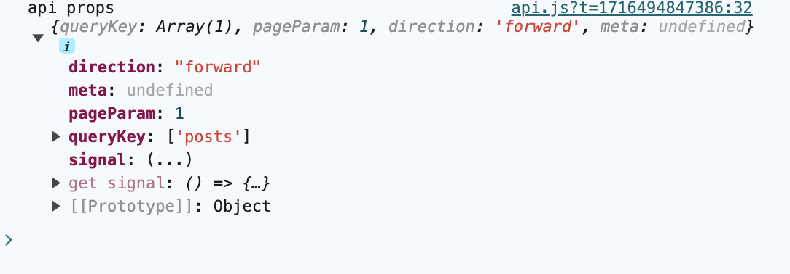
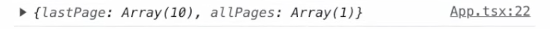
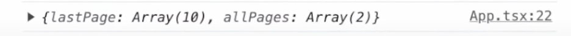
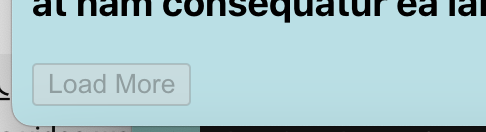
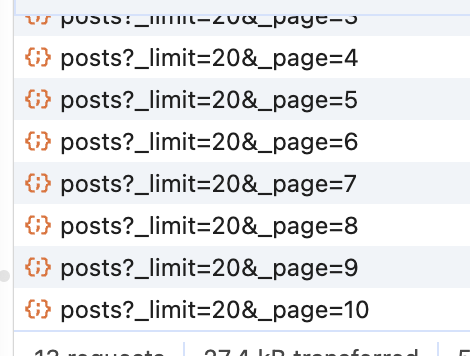
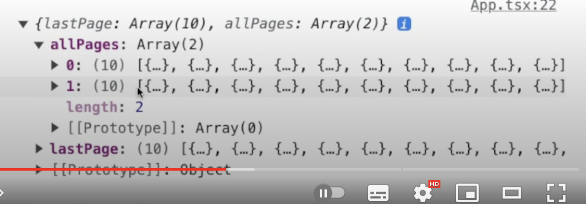

### **설치 방법**

```jsx
npm i @tanstack/react-query
```

+) 여담으로 이전에는 그냥 react-query 였다. 이후 리액트 이상으로 사용 가능하게 업데이트 되며 이름이 변경되었다. (뷰, 넥스트…)

### 세팅 방법

- 앱의 최상위에서 `QueryClientProvider`로 앱을 감싸주기
- 새로운 `QueryClient`인스턴스를 생성한 후, `QueryClientProvider`를 통해 앱 전체에서 생성한 `QueryClient`에 접근 가능하도록 해준다.

```jsx
import { QueryClient, QueryClientProvider } from '@tanstack/react-query';
...

const queryClient = new QueryClient();

function Root() {
  return (
        <QueryClientProvider client={queryClient}>
            <App />
        </QueryClientProvider>
  );
}
```

### QueryClient의 역할과 설정 방법

- `QueryClient` : `QueryCache`와 `MutationCache`를 담는 그릇
  - 직접 `QueryCache`에 접근하기보다, `QueryClient`를 통해 `QueryCache`와 `MutationCache`에 접근하여 사용함.



`QueryClientProvider`를 통해 내려준 `queryClient`에 접근하기 위해서는 `useQueryClient`를 사용해야한다.

```jsx
const queryClient = useQueryClient();
```

- queryClient 내부



만약 이렇게 선언했다면?

```jsx
const queryClient = new QueryClient({
  defaultOptions: {
    queries: {
      staleTime: 20000,
    },
  },
});
```

`defaultOption`을 설정한걸 확인 가능



### options

1. **queryCache?: QueryCache**
   - _쿼리 캐시_: 이 옵션은 이 클라이언트가 연결된 쿼리 캐시를 지정
   - 쿼리 캐시는 서버로부터 가져온 데이터를 저장하고 관리하는 역할
     - 이 클라이언트가 연결된 캐시를 지정함으로써, 클라이언트의 모든 쿼리 요청은 이 캐시를 통해 데이터를 가져옴
2. **mutationCache?: MutationCache**
   - _뮤테이션 캐시_: 이 옵션은 이 클라이언트가 연결된 뮤테이션 캐시를 지정
   - 뮤테이션 캐시는 서버로 보낸 데이터 변경 요청을 저장하고 관리하는 역할
     - 클라이언트가 연결된 캐시를 지정함으로써, 데이터 변경 작업에 대한 결과를 캐시에서 가져옴
3. **defaultOptions?: DefaultOptions**
   - _기본 옵션_: 이 옵션은 이 쿼리 클라이언트를 사용하는 모든 쿼리와 뮤테이션에 대한 기본값 정의
   - 이 옵션을 사용하면 모든 쿼리 및 뮤테이션에 대해 공통적으로 적용되는 기본값을 설정
     - e.g. ) 캐시 사용 여부, 요청 시간 제한, 에러 재시도 횟수

### **cache**

- React Query는 설정한 **`cacheTime`**만큼(기본값은 5분) 데이터를 메모리에 저장한다.
- QueryCache 객체의 **`queries`** 배열과 **`queriesInMap`** 객체에 Query 객체가 존재하는 것을 말한다.
  - 중요한 것은 **cache가 존재한다고 해서 data refetching을 하지 않는 것이 아니다**.
  - cache가 존재하더라도 해당 데이터(Query 객체)가 stale 상태라면 refetching을 수행한다.

### **stale**

- 설정한 **`staleTime`**만큼(기본값은 0초) 데이터가 fresh 상태로 존재하였다가 그 후에는 stale 상태로 바뀐다.
  - fresh == 데이터를 그대로 사용해도 좋을 만큼 신선한 상태라는 뜻
  - stale == 데이터를 새롭게 fetch해 오는 것이 필요할 만큼 신선하지 못한 상태
- e.g. ) **`staleTime`**을 10,000으로 설정하였다면?
  - data fetching이 성공한 후 10초(= 10,000ms) 동안 fresh 상태로 존재하다가 10초 이후에는 stale 상태가 된다.
  - stale 상태가 된 후 특정 조건이 충족되면 refetching이 발생
  - 주의할 점은 stale 상태가 되었다고 해서 refetching이 곧바로 일어나는 것 X
  - **stale 상태가 되고 특정조건을 만족해야 refetching이 일어난다는 것 O**



### QueryCache

- `QueryCache`는 javascript 객체
- 우리가 Query를 생성하면, `queryHash`를 객체의 key로, query 인스턴스를 값으로 넣어준다.
  그리고 `queries` 라는 배열에 query 인스턴스를 추가 할 수 있음



- 여기서 `queryHash`는 query key를 stringify한 값
- 따라서 query 생성시 반드시 query key로 유니크한 값을 지정해야함

### Query

- `QueryCache`의 value로 Query 객체 안에는 Query의 모든 정보들이 들어있다.
- `cache`에 자신이 위치한 `QueryCache`정보를 가지고 있으며, `observers`라는 배열도 가지고 있다.
- 이 `observers`에는 `QueryObserver`가 담긴다.
- `Query`는 `Observer`를 통해 누가 자신을 구독했는지 알고, `Observer`를 통해 모든 변경사항을 알릴 수 있다.

### QueryObserver

- `useQuery호출 시` `Observer`가 생성된다. 이 `Observer`를 통해 `Query`와 컴포넌트가 연결된다.
- `Observer` 에는 `QueryClient` 객체를 비롯하여 현재 `Query`, 랜더링 유발 여부를 파악하기 위한 현재 결과값 등이 담겨있다.




