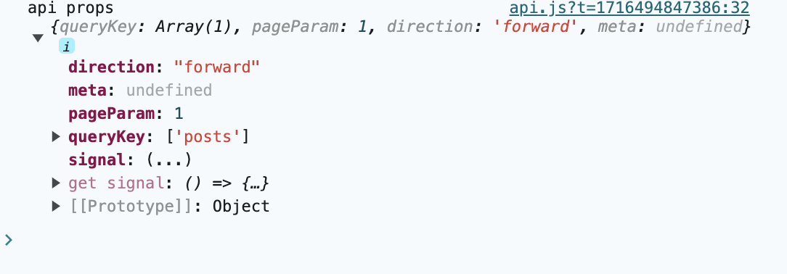
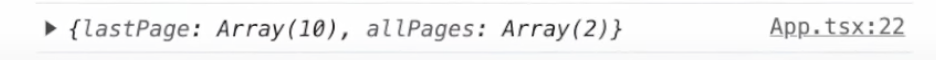
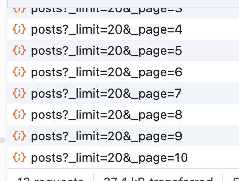
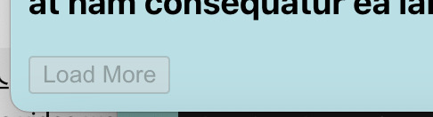

## 0.이번 학습 요약

### 0-1. Pagination

- Pagination 개념을 확인한다.
- Pagination prefetching을 사용해 사용자 경험을 개선한다.

### 0-2. 무한 스크롤 구현

- 리액트 쿼리의 `useInfiniteQuery`훅을 사용해 무한스크롤 pagenation을 구현해본다.
  - useInfiniteQuery의 파라미터인 getNextPageParam,getPreviousPageParam도 배워본다.

---

</br>
</br>

## 1. Pagination

- pagination이란 데이터를 페이지 단위로 나누어(api가 이미 page별로 나눠져있어야하는듯) 사용자가 직접 탐색할 수 있도록 하는것이다.
- 이를 구현하기 위해 서버에서 특정 페이지 데이터를 요청하고 응답받는 과정을 반복한다.

아래와 같은 post들을 page별로 받아오는 api에서 받아오는 함수가 있다.

```javascript
export async function fetchPosts(pageNum = 1) {
  const response = await fetch(
    `https://jsonplaceholder.typicode.com/posts?_limit=10&_page=${pageNum}`
  );
  return response.json();
}
```

```javascript
import { useState } from "react";

import { useQuery } from "@tanstack/react-query";
import { PostDetail } from "./PostDetail";
import { fetchPosts } from "./api";
const MAX_POST_PAGE = 10;

export function Posts() {
  const INITIAL_PAGE_NUMBER = 1;
  const [currentPage, setCurrentPage] = useState(INITIAL_PAGE_NUMBER);
  const [selectedPost, setSelectedPost] = useState(null);

  const { data, isError, error, isLoading } = useQuery({
    queryKey: ["posts", currentPage],
    queryFn: () => fetchPosts(currentPage),
    staleTime: 1000 * 2,
  });

  if (isLoading) {
    return <h3> 로딩 중 ㅋ</h3>;
  }

  if (isError) {
    console.log("error", error);
    return (
      <>
        <h3> something go wrong </h3>
        <p>{error.message}</p>
      </>
    );
  }

  return (
    <>
      <ul>
        {data.map((post) => (
          <li
            key={post.id}
            className="post-title"
            onClick={() => setSelectedPost(post)}
          >
            {post.title}
          </li>
        ))}
      </ul>
      <div className="pages">
        <button
          disabled={currentPage === INITIAL_PAGE_NUMBER}
          onClick={() => {
            setCurrentPage((prev) => Math.max(INITIAL_PAGE_NUMBER, prev - 1));
          }}
        >
          Previous page
        </button>
        <span>Page {currentPage}</span>
        <button
          disabled={currentPage >= MAX_POST_PAGE}
          onClick={() => {
            setCurrentPage((prev) => prev + 1);
          }}
        >
          Next page
        </button>
      </div>
      <hr />
      {selectedPost && <PostDetail post={selectedPost} />}
    </>
  );
}
```

위 코드 딱히 설명할거 없는듯
위와 같이해도 다음 페이지 버튼 누르면 페치 잘해오긴함
근데 다음 페이지 누를때 마다 로딩중 뜸
-> prefetching으로 개선해보자.

## 2. Prefetching

- 닉값대로 데이터를 미리 가져와서 캐시에 넣어 사용자가 데이터 로딩을 기다리지 않도록 하는 것이다.
- 이번에는 pagination에서 사용하지만 pagination에서만 사용하는것이라 사용자가 원하는 모든 데이터에 사용할 수 있다.

-쿼리 클라이언트의 `prefetchQuery` 메서드를 사용해 구현해 볼 수 있다.

일단 `useQueryClient` 훅을 사용해서 query client를 가져온다.

```javascript
import { useEffect, useState } from "react";

import { useQuery, useQueryClient } from "@tanstack/react-query";
import { PostDetail } from "./PostDetail";
import { fetchPosts } from "./api";
const MAX_POST_PAGE = 10;

export function Posts() {
  const INITIAL_PAGE_NUMBER = 1;
  const [currentPage, setCurrentPage] = useState(INITIAL_PAGE_NUMBER);
  const [selectedPost, setSelectedPost] = useState(null);

  // 쿼리 클라이언트 가져오기
  const queryClient = useQueryClient();

  useEffect(() => {
    if (currentPage < MAX_POST_PAGE) {
      const NEXT_PAGE = currentPage + 1;
      queryClient.prefetchQuery({
        queryKey: ["posts", NEXT_PAGE],
        queryFn: () => fetchPosts(NEXT_PAGE),
      });
    }
  }, [currentPage, queryClient]);

  const { data, isError, error, isLoading } = useQuery({
    queryKey: ["posts", currentPage],
    queryFn: () => fetchPosts(currentPage),
    staleTime: 1000 * 2,
  });

  if (isLoading) {
    return <h3> 로딩 중 ㅋ</h3>;
  }

  if (isError) {
    console.log("error", error);
    return (
      <>
        <h3> something go wrong </h3>
        <p>{error.message}</p>
      </>
    );
  }

  return (
    <>
      <ul>
        {data.map((post) => (
          <li
            key={post.id}
            className="post-title"
            onClick={() => setSelectedPost(post)}
          >
            {post.title}
          </li>
        ))}
      </ul>
      <div className="pages">
        <button
          disabled={currentPage === INITIAL_PAGE_NUMBER}
          onClick={() => {
            setCurrentPage((prev) => Math.max(INITIAL_PAGE_NUMBER, prev - 1));
          }}
        >
          Previous page
        </button>
        <span>Page {currentPage}</span>
        <button
          disabled={currentPage >= MAX_POST_PAGE}
          onClick={() => {
            setCurrentPage((prev) => prev + 1);
          }}
        >
          Next page
        </button>
      </div>
      <hr />
      {selectedPost && <PostDetail post={selectedPost} />}
    </>
  );
}
```

- `useEffect`를 이용해 `currentPage`가 바뀔 때 마다 prefectch하도록 구현했다.
- 주의해야할 점은 `prefetchQuery`의 query key는 `useQuery`의 query key와 동일해야한다.
  왜냐하면 리액트 쿼리가 캐시에 이미 데이터가 있는지 확인할 때 이 key를 찾기 때문이다.


dev tool을 이용해 확인해보면 현재 페이지가 6페이지인데, 미리 7페이지의 데이터를 fetch 해놓은것을 확인 할 수 있고, 앞서 구현했던거와 달리 다음 페이지 버튼을 눌러도 로딩이 없다.

## 3. useInfiniteQuery

이번에는 리액트 쿼리의 `useInfiniteQuery`를 이용하여 pagination을 해보자..
`prefetchQuery` 사용법은 `useQuery`와 매우 비슷하다.

```javascript
export async function fetchInfinityPosts(props) {
  console.log("api props", props);
  const response = await fetch(
    `https://jsonplaceholder.typicode.com/posts?_limit=20&_page=1`
  );
  return response.json();
}
```

```javascript
import { useInfiniteQuery } from "@tanstack/react-query";
import { fetchInfinityPosts } from "./api";

export default function InfiniteScrollPosts() {
  const { data } = useInfiniteQuery({
    queryKey: ["posts"],
    queryFn: fetchInfinityPosts,
    initialPageParam: 1,
    getNextPageParam: (lastPage) => {
      // 이건 나중에 설명
      lastPage;
    },
  });

  return (
    <div className="postList">
      {data.pages.map((posts) =>
        posts.map((post) => <h3 key={post.id}>{post.title}</h3>)
      )}
      <button>Loading More</button>
    </div>
  );
}
```

`console.log` 찍힌걸 보면 아래와 같다.


fetch 함수의 param에 `useInfiniteQuery`의 props들이 들어간걸 볼 수 있다.
`initialPageParam`이 api에 들어갔으면 좋겠으니 아래와 같이 수정한다.

```javascript
export async function fetchInfinityPosts({ pageParam }) {
  const response = await fetch(
    `https://jsonplaceholder.typicode.com/posts?_limit=20&_page=${pageParam}`
  );
  return response.json();
}
```

</br>

이제 status,error도 추가해보자

```javascript
import { useInfiniteQuery } from "@tanstack/react-query";
import { fetchInfinityPosts } from "./api";

export default function InfiniteScrollPosts() {
  const { data, status, error } = useInfiniteQuery({
    // status,error 추가
    queryKey: ["posts"],
    queryFn: fetchInfinityPosts,
    initialPageParam: 1,
    getNextPageParam: (lastPage) => {
      lastPage;
    },
  });

  if (status === "pending") {
    return <p>로딩 중...</p>;
  }

  if (status === "error") {
    return <p>ERROR : {error.message}</p>;
  }

  return (
    <div className="postList">
      {data.pages.map((posts) =>
        posts.map((post) => <h3 key={post.id}>{post.title}</h3>)
      )}
      <button>Load More</button>
    </div>
  );
}
```

이제 "Load More" 버튼을 눌렀을 때, 다음 페이지를 불러오도록 해보자.

```javascript
import { useInfiniteQuery } from "@tanstack/react-query";
import { fetchInfinityPosts } from "./api";

export default function InfiniteScrollPosts() {
  const { data, status, error, fetchNextPage } = useInfiniteQuery({
    // fetchNextPage 추가
    queryKey: ["posts"],
    queryFn: fetchInfinityPosts,
    initialPageParam: 1,
    getNextPageParam: (lastPage) => {
      2;
    },
  });

  if (status === "pending") {
    return <p>로딩 중...</p>;
  }

  if (status === "error") {
    return <p>ERROR : {error.message}</p>;
  }

  return (
    <div className="postList">
      {data.pages.map((posts) =>
        posts.map((post) => <h3 key={post.id}>{post.title}</h3>)
      )}
      <button onClick={() => fetchNextPage()}>Load More</button>
    </div>
  );
}
```


버튼을 누르면 위와같이 2페이지를 페칭하는것을 볼 수 있다.
`getNextPageParam`이 현재 2를 return 하기 때문이다.

#### getNextPageParam

- 다음 페이지를 가져올 때 사용할 파라미터를 결정하는데 사용된다.
- 다음 페이지로 넘어가기 위한 파라미터를 반환한다. 마지막 페이지의 정보를 바탕으로 다음 페이지 번호를 결정한다.
  - allPages,lastPage 를 사용할 수 있음

```javascript
const { data, status, error, fetchNextPage } = useInfiniteQuery({
  queryKey: ["posts"],
  queryFn: fetchInfinityPosts,
  initialPageParam: 1,
  getNextPageParam: (lastPage, allPages) => {
    console.log({ lastPage, allPages });
    return 2;
  },
});
```

`lastPage`,`allPages`가 뭔지 알아보기 위해 `console.log`를 찍어보자.

1페이지에서는 위와같이 나오고


2페이지를 페칭하고나서는 이렇게된다.


- `allPages` : 이름대로 지금까지 로드한 모든 페이지들
- `lastPage` : 이름대로 마지막 페이지 정보

```javascript
const { data, status, error, fetchNextPage } = useInfiniteQuery({
  queryKey: ["posts"],
  queryFn: fetchInfinityPosts,
  initialPageParam: 1,
  getNextPageParam: (lastPage, allPages) => {
    return allPages.length + 1;
  },
});
```

따라서 `allPages.length`는 현재까지 페이지수이므로
`getNextPageParam`이 `allPages.length + 1`을 return하도록하면 다음 페이지를 계속 불러오게 할 수 있다.

이제 다음 페이지 불러오긴하는데 페치해오는 동안 화면에 아무 반응이 없다.

```javascript
export default function InfiniteScrollPosts() {
  const { data, status, error, fetchNextPage, isFetchingNextPage } =
    // isFetchingNextPage 추가
    useInfiniteQuery({
      queryKey: ["posts"],
      queryFn: fetchInfinityPosts,
      initialPageParam: 1,
      getNextPageParam: (lastPage, allPages) => {
        return allPages.length + 1;
      },
    });

  if (status === "pending") {
    return <p>로딩 중...</p>;
  }

  if (status === "error") {
    return <p>ERROR : {error.message}</p>;
  }

  return (
    <div className="postList">
      {data.pages.map((posts) =>
        posts.map((post) => <h3 key={post.id}>{post.title}</h3>)
      )}
      <button onClick={() => fetchNextPage()}>
        {isFetchingNextPage ? "Loading more..." : "Load More"}
        // 버튼 수정
      </button>
    </div>
  );
}
```


- 다음 페이지 데이터를 패치해오는 동안 버튼 렌더링이 바뀌는것을 볼 수 있다.

[https://jsonplaceholder.typicode.com/posts?\_limit=20&\_page=5](https://jsonplaceholder.typicode.com/posts?_limit=20&_page=5)
[https://jsonplaceholder.typicode.com/posts?\_limit=20&\_page=6](https://jsonplaceholder.typicode.com/posts?_limit=20&_page=6)

위 api 요청 결과를 보면 6페이지에서부터는 데이터 반환을 하지 않는것을 볼수있다.
즉 5페이지가 마지막 페이지라는 것이다.

5페이지에 도달해서 "Load More" 버튼을 누르면 아무것도 받아오지 않는것을 볼 수있다.

이럴 때 사용할 수 있는것이 `hasNextPage`이다.
`hasNextPage`가 `false`이면 "Load More" 버튼을 `disabled` 해주도록 하자.

```javascript
export default function InfiniteScrollPosts() {
  const {
    data,
    status,
    error,
    fetchNextPage,
    isFetchingNextPage,
    hasNextPage,
  } =
    // hasNextPage 추가
    useInfiniteQuery({
      queryKey: ["posts"],
      queryFn: fetchInfinityPosts,
      initialPageParam: 1,
      getNextPageParam: (lastPage, allPages) => {
        return allPages.length + 1;
      },
    });

  if (status === "pending") {
    return <p>로딩 중...</p>;
  }

  if (status === "error") {
    return <p>ERROR : {error.message}</p>;
  }

  return (
    <div className="postList">
      {data.pages.map((posts) =>
        posts.map((post) => <h3 key={post.id}>{post.title}</h3>)
      )}
      <button disabled={!hasNextPage} onClick={() => fetchNextPage()}>
        {/* 버튼에 disabled 추가 */}
        {isFetchingNextPage ? "Loading more..." : "Load More"}
      </button>
    </div>
  );
}
```

근데 위와 같이 수정해도 여전히 버튼은 disabled 되지않고

이렇게 쭉 get 요청을 보낸다.
이유는

```javascript
// ... 코드 생략
      getNextPageParam: (lastPage, allPages) => {
        return allPages.length + 1;
      },

```

`getNextPageParam` 가 여전히 `allPages.length + 1`를 return 하고있기 때문이다.

```javascript
// ... 코드 생략
 getNextPageParam: (lastPage, allPages) => {
        const nextPage = lastPage.length ? allPages.length + 1 : undefined
        return nextPage
      },

```

위와 같이 수정해보자.


그럼 마지막 페이지(5페이지)에서 "Load More" 버튼을 눌렀을 때, 버튼이 disabled 되는것을 볼수있다.

```javascript
 <button disabled={!hasNextPage} onClick={() => fetchNextPage()}>
```

버튼의 `disabled`에 사용된 `hasNextPage`는 `getNextPageParam`이 `number`를 return 할 때 일 때 `true`이기 때문이다.

```javascript
 <button disabled={!hasNextPage || isNextFetchingPage} onClick={() => fetchNextPage()}>
```

disabled에 위와 같이 `isNextFetchingPage`도 추가해줘서 페이지를 페칭하고있을 때도 버튼이 disabled 되도록하자.

```javascript
<button
  disabled={!hasNextPage || isNextFetchingPage}
  onClick={() => fetchNextPage()}
>
  {isFetchingNextPage
    ? "Loading More..."
    : hasNextPage
    ? "Load More"
    : "Nothing to load more"}
</button>
```

위와같이 버튼 문구 조건도 더 추가해보자.

### Load More 버튼 대신 인피니트 스크롤 심기

> [NPM | react-intersection-observer](https://www.npmjs.com/package/react-intersection-observer)

```
npm i react-intersection-observer
```

위 라이브러리를 설치해보자.

```javascript
export default function InfiniteScrollPosts() {
  // 추가된 부분
  const { ref, inView } = useInView({
    /* Optional option */
    threshold: 0,
  });

  const {
    data,
    status,
    error,
    fetchNextPage,
    isFetchingNextPage,
    hasNextPage,
  } = useInfiniteQuery({
    queryKey: ["posts"],
    queryFn: fetchInfinityPosts,
    initialPageParam: 5,
    getNextPageParam: (lastPage, allPages) => {
      const nextPage = lastPage.length ? allPages.length + 1 : undefined;
      return nextPage;
    },
  });

  // 추가된 부분
  useEffect(() => {
    console.log(inView);
  }, [inView]);

  if (status == "pending") {
    return <div>어쩔</div>;
  }

  if (status === "error") {
    return <div>{error.message}</div>;
  }

  if (status === "success") {
    return (
      <div className="postList">
        {data.pages.map((posts) =>
          posts.map((post) => <h3 key={post.id}>{post.title}</h3>)
        )}
        <button
          ref={ref}
          disabled={!hasNextPage || isFetchingNextPage}
          onClick={() => fetchNextPage()}
        >
          {isFetchingNextPage
            ? "Loading more..."
            : hasNextPage
            ? "Load more"
            : "Nothing more to load"}
        </button>
      </div>
    );
  }
}
```

위 코드처럼
button에 ref를 연결시켜주고 inView를 console.log 찍어보자


버튼이 브라우저상에서 보여질 때 `inView`값이 `true`로 변하는 모습을 볼 수 있다.
브라우저에서 버튼이 안보이게되면 `false`가 된다.

`inView`와 `ref`가 뭔지 알았으니 이제 수정해보자

```javascript
export default function InfiniteScrollPosts() {
  const { ref, inView } = useInView({
    /* Optional option */
    threshold: 0,
  });

  const {
    data,
    status,
    error,
    fetchNextPage,
    isFetchingNextPage,
    hasNextPage,
  } = useInfiniteQuery({
    queryKey: ["posts"],
    queryFn: fetchInfinityPosts,
    initialPageParam: 5,
    getNextPageParam: (lastPage, allPages) => {
      const nextPage = lastPage.length ? allPages.length + 1 : undefined;
      return nextPage;
    },
  });

  useEffect(() => {
    if (inView && hasNextPage) {
      fetchNextPage();
    }
  }, [inView, hasNextPage, fetchNextPage]);

  if (status == "pending") {
    return <div>어쩔</div>;
  }

  if (status === "error") {
    return <div>{error.message}</div>;
  }

  if (status === "success") {
    return (
      <div className="postList">
        {data.pages.map((posts) =>
          posts.map((post) => <h3 key={post.id}>{post.title}</h3>)
        )}
        <button ref={ref}></button>
        {isFetchingNextPage && <h4>Loading ...</h4>}
      </div>
    );
  }
}
```

잘되는것을 확인 할 수 있을것이다...

```javascript
const { ref, inView } = useInView({
  /* Optional option */
  threshold: 0,
});
```

#### `useInView`의 `threshold`는 무슨 값?

threshold 옵션은 useInView 훅에서 사용되는 옵션 중 하나로, Intersection Observer API의 threshold 옵션과 동일한 역할을 한다.
threshold 값은 0부터 1 사이의 숫자 또는 숫자 배열로 지정할 수 있다. 이 값은 관찰 대상 요소와 뷰포트 사이의 교차 영역이 전체 요소 영역에 대해 얼마나 차지해야 콜백 함수가 호출될 것인지를 결정한다.

- threshold: 0은 관찰 대상 요소가 뷰포트와 1픽셀이라도 교차되는 순간 콜백 함수가 호출된다.
- threshold: 1은 관찰 대상 요소가 뷰포트에 완전히 들어와야 콜백 함수가 호출된다.
- threshold: [0, 0.5, 1]과 같이 배열로 지정하면, 각 임계값마다 콜백 함수가 호출된다. 예를 들어, 이 경우에는 요소가 뷰포트와 1픽셀이라도 교차되었을 때, 50% 교차되었을 때, 100% 교차되었을 때 콜백 함수가 호출된다.

기본값은 threshold: 0이다.
예를 들어, threshold: 0.5로 설정하면 관찰 대상 요소가 뷰포트와 50% 이상 교차되었을 때 inView 값이 true로 변경되고 콜백 함수가 호출된다.
threshold 옵션을 조정하여 요소의 가시성에 따라 원하는 동작을 구현할 수 있다. 예를 들어, 무한 스크롤 구현 시 threshold: 1로 설정하면 요소가 완전히 뷰포트에 들어왔을 때 다음 데이터를 로드하도록 할 수 있다.

> 출처  
> [How to Create Infinite Scroll in React | TanStack React Query](https://www.youtube.com/watch?v=DOKp4KiVIb4)
