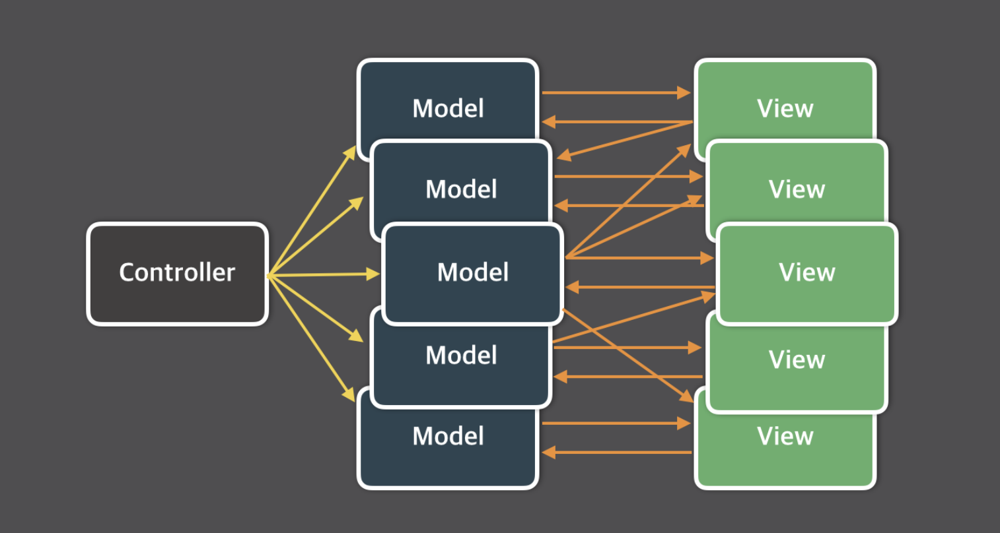
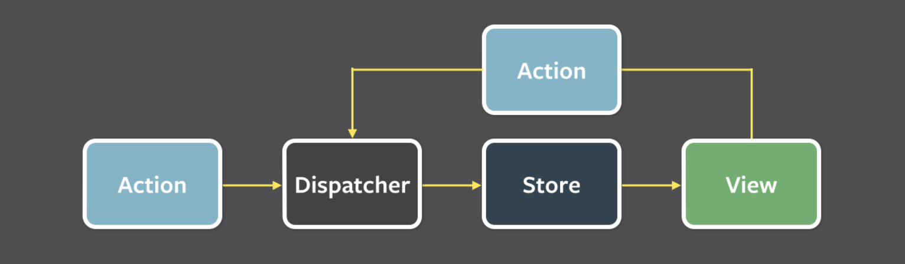

# Redux의 필요성과 핵심 개념 소개

- Redux의 동기
- Flux
- CQRS
- Event Sourcing
- Redux의 세 가지 원칙과 그 의미
  - Single source of truth
  - State is read-only
  - Changes are made with pure functions
- 액션, 리듀서, 스토어의 역할과 상호작용
  - Action
  - Reducer
  - Store
  - 사용 예시
  - redux-toolkit

### # Redux의 동기

SPA에서 많은 상태를 관리. 모델이 다른 모델을 업데이트하고 뷰가 모델을 업데이트 할 수 있고, 이에 따라 다른 뷰가 업데이트되며 **상태를 언제, 왜, 어떻게 업데이트할지 제어할 수 없는 지경에 이르고 만다.**  
React는 데이터를 관리하는 일에는 관여하지 않는 라이브러리이다.  
Redux는 상태 변화가 일어나는 시점에 제약을 두어 상태변화를 예측 가능하게 만들고자 시도한다.

## # Flux

데이터 흐름을 일관성 있게 관리함으로써 프로그램의 예측 가능성을 높이기 위함.  
기존의 MVC 패턴이 복잡해지면 다음과 같아진다. view가 다양한 상호작용을 하며 여러 model을 업데이트하고 이는 다른 VIew를 업데이트한다.



<br>
<br>

Flux는 사용자와의 상호작용에 기반해 Action을 만들고 Action을 Dispatcher에 전달하여 Store(Model)의 데이터를 변경한 후 View에 반영하는 **“단방향의 흐름”**으로 애플리케이션을 만드는 구조이다.

<br>



<br>


<br>
<br>

- **Action**

데이터를 변경하는 행위. Dispatcher에게 전달되는 객체이다. Action create 메서드는 새로 발생한 Action의 타입과 새로운 데이터(Payload)를 묶어 Dispatcher에게 전달한다.

```json
{
  type: 'SET_'Product,
  data: {
    'name': 'SHOES',
    'size': 270
  }
}
```

- **Dispatcher**

모든 데이터의 흐름을 관리하는 중앙 허브 역할. Store들이 등록해놓은 Action의 타입마다 콜백 함수들이 있다.Store의 데이터를 조작하는 것은 오직 Dispatcher를 통해 가능하며 Sotre들 사이에 의존성이 있는 상황에서도 순서에 맞게 콜백 함수를 처리하도록 관리한다.

- **Store(Model)**

상태 저장소로서 상태와 상태를 변경하는 메서드를 저장한다. Action의 타입에 따라 데이터를 변경하는 콜백 함수를 Dispatcher에 등록한다. Dispatcher의 콜백함수를 통해 상태가 변경되면 View에게 데이터 변경을 알린다.

- **View**

리액트 컴포넌트라고 할 수 있다. Store에서 View에게 상태가 변경되었음을 알려주면 최상위의 View는 Store에서 데이터를 가져와 자식 View에게 내려보낸다. 새로운 데이터를 받은 View는 화면을 리렌더링한다.

사용자가 View에 어떤 조작을 하면 그에 해당하는 Action을 생성한다.

- **Redux 공식문서의 Flux에 대한 이야기 중..**

다만 Flux와 달리 Redux에는 디스패처라는 개념이 존재하지 않는다. 이는 Redux가 이벤트 emitter보다 순수함수들에 의존하고 있기 때문이다. 그리고 순수함수는 이것들을 관리하는 추가적인 entity 없이 조합하기 쉽다.  
Flux는 (state, action) ⇒ state 형식으로 묘사된다. 따라서 Redux 역시 Flux 아키텍처라고 할 순 있지만, 순수함수를 통해 이를 더 간단히 만드는 것이다. (같은 말인데..?)  
Flux와의 또 다른 차이점은 **Redux는 당신이 결코 데이터의 상태를 바꾸지 않는다고 가정한다**는 것이다. 상태는 평범한 객체나 배열이면 충분히 다룰 수 있지만, **reducer에서 상태를 변경하지 않는 것을 강력히 권장**한다. reducer에서는 항상 새로운 객체를 반환해야한다. 따라서 spread 문법이나 Immutable을 사용한다.

## # CQRS

CQRS는 Command Query Responsibility Segregation의 약자이다. 핵심 개념은 정보를 업데이트하는 모델과 정보를 읽는 모델을 분리해 사용하는 것이다. 어떤 상황에서는 이러한 분리가 유용할 수 있지만, 대부분의 시스템에서는 CQRS가 복잡성을 더해 위험할 수 있다.  
어플리케이션의 퍼포먼스, 확장성, 보안성을 극대화할 수 있다. CQRS 패턴을 통해 만들어진 시스템의 유연성을 바탕으로 여러 요청으로부터 들어온 복수의 업데이트 명령들에 대한 충돌도 방지할 수 있다.  
CQRS에서는 Command로 데이터를 변경하고 Query로 상태를 조회한다.  
Redux에서는 액션을 통해 상태를 변경하고, 셀렉터로 상태를 조회한다.

- **전통적 아키텍처의 문제점**

대부분의 DB와 상호 작용하는 보편적인 접근 방식은 CRUD DB이다. 즉, 새로운 기록을 생성하고, 기록을 읽고, 기존 기록을 업데이트하고, 필요 없을 때 기록을 삭제할 수 있는 어떤 구조 가지고 있다. 이것은 복잡한 어플리케이션에서는 유지 보수를 어렵게 만든다. 다양한 형태의 DTO를 반환하는 다양한 쿼리를 수행할 수 있고, 이 각각의 DTO들에 대해 객체 매핑 하는 것은 복잡해진다. 또 데이터 업데이트 시 복잡한 유효성 검사와 비즈니스 로직이 수행되는데 이 모든걸 하나의 데이터 모델이 하면 너무 많은 것을 수행하는 복잡한 모델이 된다.

1. 읽기와 쓰기 작업에서 사용되는 데이터 표현들이 서로 일치하지 않는 경우가 많다. 그로 인해 일부 작업에서는 필요하지 않은 추가적인 컬럼이나 속성의 업데이트가 이뤄져야 한다.
2. 동일한 데이터 세트에 대해 병렬로 작업이 수행될 때 데이터 경합이 발생할 수 있다.
3. 정보 조회를 위해 요구되는 복잡한 쿼리로 인해 성능에 부정적인 영향을 줄 수 있다.
4. 하나의 데이터 모델이 읽기와 쓰기를 모두 수행하기 때문에, 보안 관리가 복잡해질 수 있다. (예를 들면 사용자 데이터의 경우 비밀번호가 노출되선 안된다)

- **CQRS는?**

읽기와 쓰기를 각각 다른 모델로 분리한다. Command를 통해 데이터를 쓰고, Query를 통해 데이터를 읽는다.

1. 명령(Command)은 데이터 중심적이 아니라 수행할 작업 중심이 되어야 한다. 예를 들면 '주문의 상태를 취소로 변경한다'가 아니라 ‘주문 취소'과 같이 생성되어야 한다.
2. 명령(Command)은 보통 동기적으로 처리되기보단, 비동기적으로 큐에 쌓인 후 수행된다.
3. 쿼리(Query)는 데이터 베이스를 결코 수정하지 않는다. 쿼리(Query)는 어떠한 도메인 로직도 캡슐화하지 않은 DTO만을 반환한다.

- 장점

1. 독립적인 스케일링 : CQRS는 읽기와 쓰기 각각에 대해 독립적으로 스케일링을 하는 것을 가능하게 해준다. 이는 훨씬 더 적은 Lock 경합이 발생하는 것을 가능하게 한다.
2. 최적화된 데이터 스키마 : 읽기 저장소는 쿼리에 최적화된 스키마를 사용할 수 있고, 쓰기 저장소는 쓰기에 최적화된 스키마를 사용할 수 있다.
3. 보안 : 읽기와 쓰기를 분리함으로써 보안 관리가 용이해진다.
4. 관심사 분리 : 읽기와 쓰기에 대한 관심사 분리는, 시스템의 유지 보수를 더 쉽게 해 주고 유연하게 해 준다. 대부분의 복잡한 비즈니스 로직은 쓰기 모델에 들어가고, 상대적으로 읽기 모델은 간단해진다.
5. 간단한 쿼리 : 읽기 저장소의 materialized view를 통해, 복잡한 조인문을 사용하지 않을 수 있다.

좀 더 쉽게?

[https://velog.io/@suzhanlee/CQRS-이해하기](https://velog.io/@suzhanlee/CQRS-%EC%9D%B4%ED%95%B4%ED%95%98%EA%B8%B0)

### Event Sourcing

Event Sourching은 상태를 이벤트의 시퀀스로 저장하고, 이를 통해 시스템의 현재 상태를 재구성하는 구조 패턴이다.  
예를 들어, 유저가 상품을 장바구니에 담았다가 삭제, 담았다가 삭제한다고 하자. 최종적인 관점에서는 장바구니에 상품은 없다. 하지만 비즈니스적으로 맞춤 광고를 한다면 이러한 상태 변화들을 기록하고 있지 않아 쉽지 않다. 이때 Event Sourcing을 통해 상태 변화 기록을 이용한다.  
Redux에서는 이를 복잡한 상태 변경 처리에 도움을 준다. 또 Redux DevTools에서 상태 변경 이력이나 타임 트래블 기능에서 이를 활용한다.

- 핵심 개념

  1. 이벤트 : 시스템에서 발생한 중요한 사건, 불변의 기록. 시간순으로 저장됨
  2. 이벤트 스토어 : 이벤트를 저장하는 저장소. DB나 파일시스템일 수 있다.
  3. 이벤트 핸들러 : 이벤트 처리 로직.
  4. 상태 재구성(State Reconstriction): 이벤트 소싱에서는 현재 상태를 저장하지 않고 저장된 이벤트 시퀀스를 재생하여 현재 상태를 재구성한다. 애플리케이션이 시작되면 모든 이벤트를 순차적으로 처리하여 현재 상태를 만들어 낸다.

     이벤트 수가 많아지면 상태 재구성 성능이 낮아질 수 있는지 궁금했는데, 스냅샷 기술로 이를 완화함.

<정말 궁금해? 맨 아래에 예제 둘테니 시간 되면 보셈>

# Redux의 세 가지 원칙과 그 의미

### Single source of truth

**애플리케이션의 global state는 하나의 저장소 내에서 하나의 object tree로 저장된다.**

(데이터를 저장하는 Store라는 단 하나뿐인 공간에서 동일한 데이터를 들고와야한다)
이는 서버로부터 오는 상태를 serialized 그리고 hydrated 되어 클라이언트에게 추가적인 코딩 없이 전달되도록 하며 범용적인 애플리케이션(universal apps)으로 만들기 쉽게 한다. (This makes it easy to create universal apps, as the state from your server can be serialized and hydrated into the client with no extra coding effort.)

- universal Apps : 서버와 클라이언트에서 동일한 코드를 사용할 수 있는 애플리케이션을 말한다. 이를 통해 서버 측에서 처음 HTML을 렌더링하고, 이후 클라이언트 측에서 동일한 애플리케이션 상태를 이어받아 동작할 수 있게 된다.
- State Serialization : 데이터를 특정 형식으로 변환하는 것을 의미한다. 예를 들어, 자바스크립트 객체를 JSON 문자열로 변환하는 것이 시리얼라이즈하는 과정이다. Redux 상태는 단일 객체 트리로 관리되기 때문에, 이를 JSON 형식으로 쉽게 변환할 수 있다.
- State Hydration : 서버에서 전달된 상태를 클라이언트에서 다시 객체로 복원하는 것을 의미한다. 즉, 서버에서 시리얼라이즈된 JSON 상태를 클라이언트에서 다시 자바스크립트 객체로 변환하여 사용할 수 있다. [예를 들어, 서버에서 렌더링된 HTML 마크업에 기반해 클라이언트 측에서 자바스크립트 이벤트와 상태를 연결하는 과정이다.](https://techbukket.com/blog/hydrate)

또한 하나의 상태 트리만을 가져서 디버깅에도 용이하다. 또 빠른 개발 사이클을 위해 개발 중인 앱의 상태를 저장해 놓을 수 있다. 하나의 상태 트리만을 가지기에 이전에는 구현하기 어려웠던 Undo/Redo 기능을 쉽게 구현 가능하다.

### State is read-only

**상태를 변화시키는 유일한 방법은 action 객체를 전달하는 방법 뿐이다.**

view나 network callback에서 상태를 직접 바꿀 수 없다는 것을 보장한다. 모든 상태 변화는 중앙에서 관리되며 모든 action은 엄격한 순서를 따른다. 따라서 신경써야할 미묘한 race condition은 없다. action은 평범한 객체이기에 우리는 logged할 수 있고 serialized, stored 할 수 있다. 이후 테스트나 디버깅을 위해 재현하는 것도 가능하다.

### Changes are made with pure functions

**action에 의해 상태 트리가 어떻게 변화하는지를 지정하기위해 순수한 reducer를 작성해야한다.**

reducer는 이전 상태와 액션을 받아 다음 상태를 반환하는 순수함수이다. 이전 상태를 변경하는 대신 새로운 상태 객체를 생성해서 반환해야한다는 사실을 기억하자. reducer는 평범한 함수이기에 호출 순서를 정하거나 추가 정보를 넘길 수 있다.

- reducer : 누적값과 값을 받아서 새로운 누적값을 반환하는 함수이다.

# 액션, 리듀서, 스토어의 역할과 상호작용

### Action

- 액션 이름은 고유해야한다
- 액션 객체는 type을 포함한다.

```jsx
// actionTypes.js
export const ADD_PRODUCT = "ADD_PRODUCT";
export const UPDATE_QUANTITY = "UPDATE_QUANTITY";

// actions.js
import { ADD_PRODUCT, UPDATE_QUANTITY } from "./actionTypes";

export const addProduct = (name, quantity) => ({
  type: ADD_PRODUCT,
  payload: {
    name,
    quantity,
  },
});

export const updateQuantity = (name, quantity) => ({
  type: UPDATE_QUANTITY,
  payload: {
    name,
    quantity,
  },
});
```

### Reducer

- 들어오는 액션에 따라 어떻게 상태를 변경해 새로운 상태를 반환할지 알려주는 역할
- 초기값 생성
- 리듀서는 이전 상태와 액션 함수를 인자로 받는다
  (액션이 일어나면 리듀서가 이전 상태와 액션을 받아 newState를 반환한다)

```jsx
// reducer.js
import { ADD_PRODUCT, UPDATE_QUANTITY } from "./actionTypes";

const initialState = {
  products: [],
};

const productReducer = (state = initialState, action) => {
  switch (action.type) {
    case ADD_PRODUCT:
      return {
        ...state,
        products: [...state.products, action.payload],
      };
    case UPDATE_QUANTITY:
      return {
        ...state,
        products: state.products.map((product) =>
          product.name === action.payload.name
            ? { ...product, quantity: action.payload.quantity }
            : product
        ),
      };
    default:
      return state;
  }
};

export default productReducer;
```

### Store

```jsx
// store.js
import { createStore } from "redux";
import productReducer from "./reducer";

const store = createStore(productReducer);

export default store;
```

### 사용 예시

- App에서 등록

```jsx
import React from "react";
import { Provider } from "react-redux";
import store from "./store";
import ProductList from "./ProductList";

const App = () => (
  <Provider store={store}>
    <ProductList />
  </Provider>
);

export default App;
```

- 컴포넌트에서

```jsx
import React, { useState } from "react";
import { useSelector, useDispatch } from "react-redux"; // 리덕스 훅 가져오기
import { addProduct, updateQuantity } from "./actions"; // 액션 가져오기

const ProductList = () => {
  const products = useSelector((state) => state.products); // 스토어에서 productReducer로 등록된 상태 가져오기
  const dispatch = useDispatch(); // 상태 업데이트 할 dispatch() 메소드 가져오기
  const [name, setName] = useState("");
  const [quantity, setQuantity] = useState("");

  const handleAddProduct = () => {
    dispatch(addProduct(name, parseInt(quantity, 10))); // dispatch()를 이용해서 action을 리듀서에 전달
    setName("");
    setQuantity("");
  };

  const handleUpdateQuantity = (productName) => {
    const newQuantity = prompt(`Enter new quantity for ${productName}:`);
    dispatch(updateQuantity(productName, parseInt(newQuantity, 10)));
  };

  return (
    <div>
      <h1>Product List</h1>
      <input
        type="text"
        placeholder="Product Name"
        value={name}
        onChange={(e) => setName(e.target.value)}
      />
      <input
        type="number"
        placeholder="Quantity"
        value={quantity}
        onChange={(e) => setQuantity(e.target.value)}
      />
      <button onClick={handleAddProduct}>Add Product</button>
      <ul>
        {products.map((product) => (
          <li key={product.name}>
            {product.name} - {product.quantity}
            <button onClick={() => handleUpdateQuantity(product.name)}>
              Update Quantity
            </button>
          </li>
        ))}
      </ul>
    </div>
  );
};

export default ProductList;
```

## 간단히 redux-toolkit을 살펴보면

리덕스를 쓰면 보일러플레이트가 많아서 파일을 분리함. actions, reducers, store 등..

이후 보일러플레이트를 줄인 redux-toolkit이 나옴 !

- state slice 생성하기

```jsx
import { createSlice } from "@reduxjs/toolkit";

export const counterSlice = createSlice({
  name: "counter",
  initialState: {
    value: 0,
  },
  reducers: {
    increment: (state) => {
      state.value += 1;
    },
    decrement: (state) => {
      state.value -= 1;
    },
    incrementByAmount: (state, action) => {
      state.value += action.payload;
    },
  },
});

// Action creators are generated for each case reducer function
export const { increment, decrement, incrementByAmount } = counterSlice.actions;

export default counterSlice.reducer;
```

- store 생성하기

```jsx
import { configureStore } from "@reduxjs/toolkit";
import counterReducer from "../features/counter/counterSlice";
//slice를 가져옴

export default configureStore({
  reducer: {
    counter: counterReducer,
  },
});
```

- 컴포넌트에서 사용하기

```jsx
import React from "react";
import { useSelector, useDispatch } from "react-redux";
import { decrement, increment } from "./counterSlice";
import styles from "./Counter.module.css";

export function Counter() {
  const count = useSelector((state) => state.counter.value);
  const dispatch = useDispatch();

  return (
    <div>
      <div>
        <button
          aria-label="Increment value"
          onClick={() => dispatch(increment())}
        >
          Increment
        </button>
        <span>{count}</span>
        <button
          aria-label="Decrement value"
          onClick={() => dispatch(decrement())}
        >
          Decrement
        </button>
      </div>
    </div>
  );
}
```

# 참고자료

공식 홈페이지
flux : https://haruair.github.io/flux/docs/overview.html
react-redux 튜토리얼 : https://usonkrap.github.io/2018/12/15/React-Redux-Tutorial-for-Beginners.html

### Event Sourcing 예제

: 제품이 추가되고 수량이 업데이트되는 이벤트가 발생하면, 이를 이벤트 저장소에 저장하고, 저장된 이벤트를 재생하여 현재 상태를 재구성한다. Event Sourcing을 사용하면 애플리케이션의 상태를 이벤트로 관리하고, 과거의 상태를 추적하며, 복잡한 비즈니스 로직을 처리할 수 있다.

- 이벤트 정의

```jsx
class ProductAdded {
  constructor(productId, name, quantity) {
    this.productId = productId;
    this.name = name;
    this.quantity = quantity;
  }
}

class QuantityUpdated {
  constructor(productId, quantity) {
    this.productId = productId;
    this.quantity = quantity;
  }
}
```

- 이벤트 저장소

```jsx
class EventStore {
  constructor() {
    this.events = [];
  }

  save(event) {
    this.events.push(event);
  }

  getEvents() {
    return this.events;
  }
}
```

- 이벤트 핸들러와 상태 재구성

```jsx
class Product {
  constructor(productId) {
    this.productId = productId;
    this.name = "";
    this.quantity = 0;
  }

  apply(event) {
    if (event instanceof ProductAdded) {
      this.name = event.name;
      this.quantity = event.quantity;
    } else if (event instanceof QuantityUpdated) {
      this.quantity = event.quantity;
    }
  }

  static rehydrate(events) {
    const product = new Product();
    events.forEach((event) => product.apply(event));
    return product;
  }
}
```

- 사용 예시

```jsx
const eventStore = new EventStore();

const addProductEvent = new ProductAdded(1, "Apple", 10);
eventStore.save(addProductEvent);

const updateQuantityEvent = new QuantityUpdated(1, 20);
eventStore.save(updateQuantityEvent);

const events = eventStore.getEvents();
const product = Product.rehydrate(events);

console.log(product); // { productId: 1, name: 'Apple', quantity: 20 }
```
